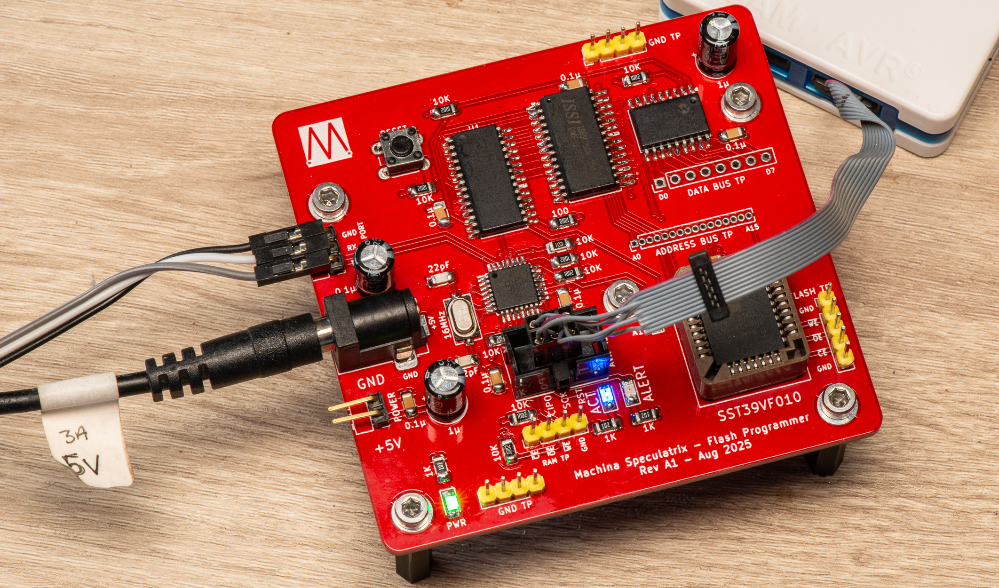

# FlashROM

This is a project to create a dev board for writing ROM images to flash memory. It's intended as a proof of concept project with the ultimate goal of integrating its functions into the main CPU board of the [Zolatron homebrew computer](https://medium.com/machina-speculatrix/subpage/0b8cf602629b).

I'm documenting the project on [Machina Speculatrix](https://medium.com/machina-speculatrix), my Medium-based publication. (A Medium sub is required to read the articles.)

The articles are:

- [Using flash memory as a homebrew computer ROM](https://medium.com/machina-speculatrix/using-flash-memory-as-a-homebrew-computer-rom-6c459e0632cc)
- [A development board for flash-based ROM](https://medium.com/machina-speculatrix/a-development-board-for-flash-based-rom-d9f2fdf9bcad)
- [Software for the flash ROM development board](https://medium.com/machina-speculatrix/software-for-the-flash-rom-development-board-8913ffe00429).

I'm using the SST39SF010A flash chip, with a view to incorporating this into my [Zolatron 6502-based homebrew computer](https://medium.com/machina-speculatrix/subpage/0b8cf602629b) project. The IC offers 1Mbit (128KB) of storage of which, with the current configuration, my dev board can address only half.

The dev board consists of an ATMEGA328PB microcontroller, SRAM, port expanders to handle the data and address buses, the flash memory and a serial port to talk to a PC. Schematics and Gerbers for the dev board are in the `Hardware` folder.

The dev board.

The code consists of:

- `**flashprog**` : C++ code for an ATmega328PB running at 16MHz.
- `**flashterm**` : Python code to run on the PC to interact with `flashprog`. Uses curses and pyserial.
- `**flashz**` : C++ code for an ATmega4809 running at 20MHz. A stripped-down version of `flashprog` intended for use with `flashburn` below. A proof-of-concept for integrating all this flash malarky into the Zolatron project.
- `**flashburn**` : Python code. Simplified CLI version of `flashterm` with no curses and just used to upload & flash image without using RAM. Intended for use with scripting. Works with and ATmega4809 running `flashz`. Doesn't work with `flashprog`.

Python code running on Linux.

## VERSION HISTORY

Dates are when the `dev` branch was merged into `main`.

### VERSION 1.5 - 03/10/2025

- Created `flashz` and modified `flashburn.py` to work with it.

### VERSION 1.4 - 27/09/2025

- Created `flashburn.py`. Working.
- Added function to erase Flash (useful for debugging).
- Added function to upload data & write to Flash directly, without using the RAM.
- Squashed the address input bug.
- Added images to repo.

### VERSION 1.3 - 24/09/2025

- First fully working version with one slight address input bug and a lot of rough edges.

## TO DO

- [flashterm.py] Allow user setting of serial port.
- [both] Try increasing serial speed for faster upload.
